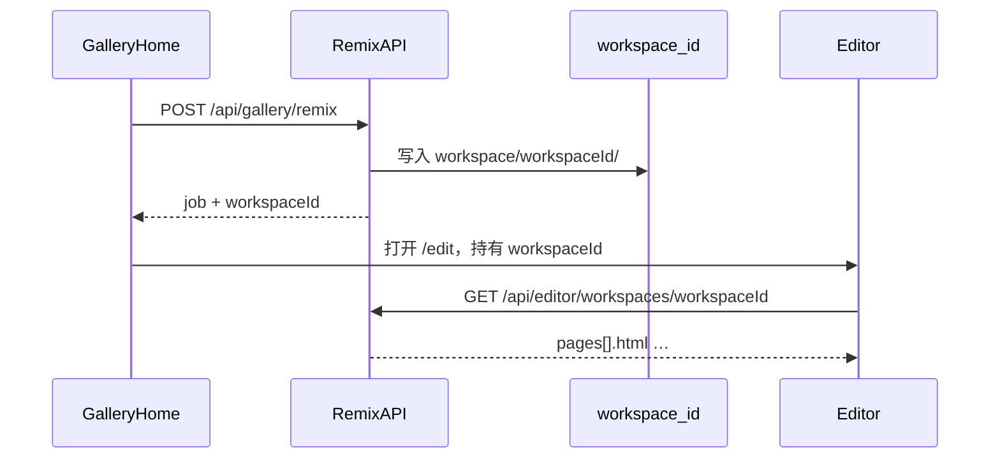
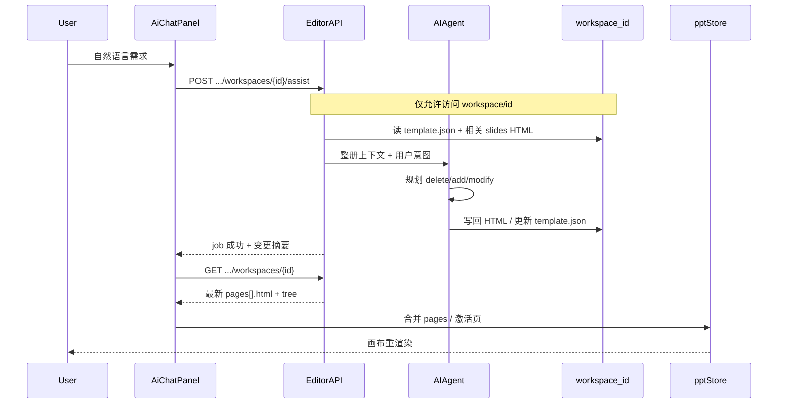

# AI 帮写（编辑器对话改 PPT）需求文档

| 项 | 内容 |
|----|------|
| 产品 | WebPPT / Ai Prept 编辑器 |
| 功能名 | AI 帮写（AI Assistant） |
| 文档版本 | v0.2 |
| 日期 | 2026-10-01 |
| 状态 | 需求澄清 / 基线已部分落地 |
| 鉴权 | **本期不考虑登录**；按会话包 `workspaceId`（临时 id）操作即可 |

---

## 1. 背景与目标

用户在**首页选择模板并生成**得到一份 HTML 幻灯片后，进入编辑器。希望通过右侧 AI 对话，用自然语言驱动：

1. **按会话 id 读取**该临时包内文件，理解整册上下文；
2. 按用户意图执行 **删除 / 新增 / 修改** 页面（HTML）；
3. 将变更写回临时包，并把**更新后的内容返回前端**重新渲染。

### 1.1 成功标准（本期）

- 首页 remix 产物写入**独立临时目录**（**不**再写入 `agent-output/` 或其子目录）。
- 每个会话有稳定唯一 **id**；编辑器与 AI API 全程用该 id 定位包。
- AI 只读该 id 对应目录下的 `template.json` / `slides/*.html` / `theme.css` / `images/` 等，据此做增删改决策。
- 操作完成后前端拿到最新 HTML（全量文档或变更列表）并重渲染画布 / 缩略图 / 文件树。
- 不依赖登录；本地开发可用；临时包可过期清理。

### 1.2 非目标（本期不做）

- 用户登录、权限、多租户隔离、计费面板。
- 把首页会话包写入模板库 / 审批流（那是 `agent-output` 职责）。
- 整册从零生成（已有 remix / ppt-master 管线）。
- 改 `theme.css` 全局色板、重新批量生图（可作为后续增强）。
- 协作编辑、实时多人光标。
- 自动根据刷新浏览器取消服务端任务（任务仍可服务端独立运行）。

---

## 1.3 存储模型（相对 v0.1 的关键变更）

### 职责拆分

| 目录 | 用途 | 是否给首页 remix | 是否给 AI 帮写主路径 |
|------|------|------------------|----------------------|
| `agent-output/<templateId>/` | 模板库 / Admin 产物 / 审批素材 | **否** | 仅「打开已有库模板」等次要路径可选 |
| **`workspace/<workspaceId>/`**（新建，仓库根级） | **首页选模板生成的临时 PPT 包** | **是** | **是（主路径）** |

> 命名：下文统一称 **`workspaceId`**（会话/工作区 id）。前端 store 里可继续叫 `templateId` 字段，但语义上指向 workspace 包，不再暗示必须在 `agent-output`。

### 包结构（与现模板包对齐，便于复用加载逻辑）

```text
workspace/
  <workspaceId>/
    template.json          # 元数据、slides 列表、可选 expiresAt
    theme.css
    slides/
      cover.html
      …
    images/
      …
    visual-spec.md         # 可选
```

### Id 与生命周期

| 规则 | 说明 |
|------|------|
| 生成时机 | 首页「使用模板 / remix」任务成功创建包时分配 `workspaceId`（短随机串，现有 public id 规则可复用） |
| 前端持有 | URL / `pptStore` / sessionStorage 保存 `workspaceId`，编辑器 AI 请求必带 |
| 临时性 | 默认 TTL（建议 7 天，可配置）；后台定时清理过期目录 |
| 不入库 | **不**写入 gallery / Admin 模板列表；与 `agent-output` 隔离 |
| 解析 API | `resolve_workspace(workspaceId)` 只查 `workspace/`，禁止路径穿越 |

### 与现状差距

| 项 | 现状 | 目标 |
|----|------|------|
| 首页 remix 输出根 | `agent-output/sessions/<id>/` | **`workspace/<id>/`（离开 agent-output）** |
| 路径解析 | `template_dir`：catalog → sessions | catalog 与 workspace **分流**；AI/编辑器会话主走 workspace |
| AI 读写 | 已能按 id 读写（仍落在 agent-output 树下） | 改为读 **workspace** 包，改完把内容回传前端 |

---

## 2. 用户故事

| ID | 作为… | 我想… | 以便… |
|----|--------|--------|--------|
| US-0 | 首页用户 | 选模板生成后得到一个临时 id 对应的 PPT 包 | 编辑与 AI 都对着这份临时稿，不污染模板库 |
| US-1 | 编辑用户 | 用自然语言描述「把封面标题改短、拉开与图片间距」 | 不必手改 HTML |
| US-2 | 编辑用户 | 说「在第 3 页后加一页案例总结」 | 快速扩页且风格统一 |
| US-3 | 编辑用户 | 说「删掉重复的过渡页」或「删除第 5 页」 | 精简结构 |
| US-4 | 编辑用户 | 一次说清「删掉末页、改目录、再加一页 FAQ」 | 少切模式、少轮确认 |
| US-5 | 编辑用户 | 看到 AI 正在做什么、成功/失败原因 | 可重试、可信任 |

---

## 3. 核心流程

### 3.0 首页生成 → 进入编辑器



### 3.1 AI 帮写（按 id 读文件 → 决策 → 回传前端）



> **回传约定（P0）**：Job 成功后前端必须能拿到最新内容并渲染。推荐：  
> 1）`GET /api/editor/workspaces/{id}` 返回全量 `pages[].html`（主路径）；  
> 2）Job 响应附带 `changedFiles` / `deletedFiles` / `addedFiles`（便于文案）；  
> 3）P2 可在 Job 内直接嵌入变更页 HTML，减少一次 GET。

### 3.2 端到端步骤

1. 前端携带：`workspaceId`、当前页 `sourceFile` / `pageIndex`、用户原文、可选本地多轮历史。
2. 后端**只**从 `workspace/<workspaceId>/` 加载大纲与相关 HTML。
3. AI 输出结构化动作计划（见 §5），校验后写回同一目录。
4. 前端拉取最新文档（或接收 Job 内嵌变更）写入 store 并重渲染。

---

## 4. 功能需求

### 4.0 临时工作区（Workspace）

| 编号 | 需求 | 优先级 | 说明 |
|------|------|--------|------|
| F-W1 | 首页 remix 输出到 `workspace/<id>/` | P0 | **禁止**再写 `agent-output` / `agent-output/sessions` |
| F-W2 | 分配唯一 `workspaceId` | P0 | 返回给前端并贯穿编辑 / AI |
| F-W3 | Editor API 按 workspace 解析 | P0 | `GET/POST /api/editor/workspaces/{id}/…`（或兼容旧路径但根目录切换） |
| F-W4 | AI 只读该 id 下文件做决策 | P0 | 不得读其它 workspace / 模板库除非显式「从库打开」 |
| F-W5 | 改完返回前端可渲染的 HTML 文档 | P0 | 全量 pages 或变更列表 + 必要 meta |
| F-W6 | TTL 清理过期 workspace | P1 | 默认 7 天；可配置；清理时不影响 `agent-output` |
| F-W7 | `.gitignore` 忽略 workspace 内容 | P0 | 临时文件不进版本库 |

### 4.1 上下文理解（Analyze）

| 编号 | 需求 | 优先级 | 说明 |
|------|------|--------|------|
| F-A1 | 整册大纲 | P0 | 页序、`file`、`title`、layout（若有） |
| F-A2 | 主题气质 | P0 | `theme.css` 摘录、`visual_style`、可选 visual_spec |
| F-A3 | 当前页全文 | P0 | 用户未指定页时默认当前页 |
| F-A4 | 邻页摘要 | P0 | 至少前后各 1～2 页标题 + 关键文案槽摘要 |
| F-A5 | 整册内容摘要 | P1 | 每页短摘要（标题 + 要点），供跨页规划；可缓存 |
| F-A6 | 配图清单 | P0 | `images/` 已有文件名；禁止幻觉新文件名 |
| F-A7 | 多轮对话记忆 | P1 | 前端本地历史传入；服务端可不持久化 |

### 4.2 修改页面（Modify）

| 编号 | 需求 | 优先级 | 说明 |
|------|------|--------|------|
| F-M1 | 按自然语言改当前页 HTML | P0 | 文案、版式、装饰可调 |
| F-M2 | 指定页改写 | P1 | 「改第 4 页…」 |
| F-M3 | 约束 | P0 | 1920×1080、`../theme.css`、仅本地图、无 script |
| F-M4 | 写盘 + 更新 `template.json` 标题 | P0 | 写入 **workspace** 包 |

### 4.3 新增页面（Add）

| 编号 | 需求 | 优先级 | 说明 |
|------|------|--------|------|
| F-N1 | 按需求生成完整新页 HTML | P0 | 插入位置：当前页后 / 指定页后 / 末尾 |
| F-N2 | 文件名不冲突 | P0 | `slides/{slug}.html` |
| F-N3 | 更新 `template.json.slides` | P0 | |
| F-N4 | 前端激活新页 | P0 | |

### 4.4 删除页面（Delete）

| 编号 | 需求 | 优先级 | 说明 |
|------|------|--------|------|
| F-D1 | 按页码 / 文件名 / 语义删除 | P0 | 「删除第 5 页」「删掉重复的目录页」 |
| F-D2 | 更新 `template.json` 并移除 HTML 文件 | P0 | 建议物理删除 |
| F-D3 | 至少保留 1 页 | P0 | 不允许删光 |
| F-D4 | 删除后激活邻近页 | P0 | 优先下一页，否则上一页 |
| F-D5 | 危险操作确认 | P1 | UI 二次确认或 AI 先回传计划再执行 |

### 4.5 复合意图（Plan + Execute）

| 编号 | 需求 | 优先级 | 说明 |
|------|------|--------|------|
| F-P1 | 单条指令可含多动作 | P1 | 先规划再执行；部分失败可回滚或报告 |
| F-P2 | 无模式切换的「帮我写」入口 | P1 | 默认智能路由；高级用户仍可选手动模式 |
| F-P3 | 仅分析不写盘 | P2 | 「先说说你打算怎么改」 |

### 4.6 前端呈现与回写

| 编号 | 需求 | 优先级 | 说明 |
|------|------|--------|------|
| F-U1 | 右侧常驻对话面板 | P0 | 已有基线 |
| F-U2 | 进行中态 / Toast / 错误信息 | P0 | |
| F-U3 | 成功后用返回内容重新渲染 | P0 | 依赖 workspace GET 或 Job 内嵌 HTML |
| F-U4 | 缩略图与文件树刷新 | P0 | tree + pages |
| F-U5 | 无 workspaceId 时禁用并提示 | P0 | |
| F-U6 | 登录 | — | **本期不做** |

### 4.7 接口与任务（后端）

| 编号 | 需求 | 优先级 | 说明 |
|------|------|--------|------|
| F-API1 | 公开 Editor API（无 Admin Token） | P0 | 作用域限制在 `workspace/<id>` |
| F-API2 | 异步 Job + 轮询 | P0 | 长耗时 LLM |
| F-API3 | Job 结果含动作摘要 | P1 | deleted/added/modified 文件列表 |
| F-API4 | 可选：Job 直接带变更页 HTML | P2 | 减少一次全量 GET |
| F-API5 | mock 模式 | P1 | 联调 / 单测 |
| F-API6 | Remix 返回 `workspaceId` | P0 | 首页轮询成功后带入编辑器 |

---

## 5. AI 动作协议（建议）

模型先输出 JSON 计划，再由服务端校验执行：

```json
{
  "summary": "删掉重复过渡页，并改写封面标题",
  "actions": [
    { "op": "delete", "pageIndex": 4, "reason": "与第3页内容重复" },
    { "op": "modify", "pageIndex": 0, "instruction": "标题缩短为12字内，下移避开主视觉" },
    { "op": "add", "afterPageIndex": 2, "instruction": "增加一页三点收获总结" }
  ]
}
```

校验规则：

- 所有读写路径必须落在 `workspace/<workspaceId>/` 内。
- `pageIndex` / `file` 必须落在当前 `slides` 内。
- `delete` 后剩余页数 ≥ 1。
- `modify` / `add` 产出 HTML 必须通过现有 sanitize + 画布 / theme / 图片白名单校验。
- 单次任务动作数建议上限（如 ≤ 5），超时可配置。

---

## 6. 数据与边界

### 6.1 数据源

- **主路径**：`workspace/<workspaceId>/`
- 元数据：`template.json`
- 页面：`slides/*.html`
- 资源：`images/*`、`theme.css`
- **模板库**（只读参考源）：`agent-output/<sourceTemplateId>/` —— 仅 remix 复制源，不作为 AI 帮写写回目标

### 6.2 边界条件

| 场景 | 期望行为 |
|------|----------|
| 无 workspaceId | 禁用 AI 发送，提示先从首页生成或打开会话 |
| workspace 目录不存在 / 已过期 | 404，提示重新生成 |
| 当前页无 sourceFile | 不可 modify；可 add；delete 需指定其他页 |
| LLM 限流 / 失败 | Job failed + 可读错误；磁盘保持上一成功态 |
| 并发两次对话 | 建议前端禁发；P1：按 workspace 加锁 |
| HTML 校验失败 | 该动作失败；复合任务声明哪些已应用 |

### 6.3 安全（无登录下的最低线）

- `workspaceId` 防路径穿越（`SAFE_TEMPLATE_DIR` 同类规则）。
- AI / Editor 写接口**不得**写到 `agent-output`（除非未来显式「发布到库」）。
- 禁止写出 `<script>`、外链图、任意路径写盘。
- 本期不解决「谁都能改本机任意 workspace」——默认信任本机开发者。

---

## 7. 与现状对照（基线）

| 能力 | 现状 | 相对本需求 |
|------|------|------------|
| 首页 remix 落盘 | `agent-output/sessions/<id>/` | **需迁到 `workspace/<id>/`**（F-W1） |
| 改当前页 | `rewrite-page` + AiChat | 逻辑可复用，**根目录需切到 workspace** |
| 新增页 | `generate-page` | 同上 |
| 删除页 | **无** | **缺口 F-D*** |
| 整册分析 | 仅邻页标题 + 单页截断 | **缺口 F-A5** |
| 智能多动作 | 需切手动模式 | **缺口 F-P1/F-P2** |
| 前端回写重渲染 | poll → GET → store | 满足方向；路径改为 workspace |
| 无登录 Editor API | `/api/editor/*` | 满足 F-API1；需绑定 workspace 根 |

---

## 8. 分期建议

### Phase 0 — 存储迁出 agent-output（优先）

- 新增 `workspace_root()`；remix / gallery job 输出改到 `workspace/<id>/`。
- `template_dir` / Editor API 支持解析 workspace；前端持有并传递 `workspaceId`。
- `.gitignore` + TTL 清理；迁移或废弃 `agent-output/sessions`。
- 验收：首页生成包**不出现**在 `agent-output/` 下。

### Phase 1 — 补齐删除 + 加强上下文

- `delete-page` + 前端模式 / 智能识别。
- 整册大纲 + 每页短摘要。
- Job 返回 `changedFiles` / `deletedFiles`。

### Phase 2 — 统一「帮我写」智能路由

- 单入口：意图分类 → 动作计划 → 执行。
- 危险删除二次确认；多动作失败报告。

### Phase 3 — 体验与稳健性

- 包级写锁、Job 内嵌变更 HTML、对话历史 localStorage。
- 可选：批量改写、重排序、「发布到模板库」（显式拷贝进 `agent-output`）。

---

## 9. 验收用例（摘要）

1. **存储**：首页选模板生成成功 → 磁盘仅见 `workspace/<id>/…`，`agent-output` 无新会话包。
2. **改页**：持 id 进入编辑器 →「封面标题改成 10 字内」→ 前端渲染更新，且变更在 `workspace/<id>/slides/…`。
3. **加页**：→「在当前页后加一页三点总结」→ 页数 +1，激活新页。
4. **删页**：→「删除第 N 页」→ 页数 -1，最少保留 1 页。
5. **回传**：Job 成功后前端无需手刷整站即可看到新 HTML。
6. **失败**：断 LLM → Toast 错误，包不被半截污染。

---

## 10. 开放问题（已拍板 / 待定）

| 问题 | 结论 |
|------|------|
| 是否需要登录？ | **本期不做** |
| 首页生成是否还进 agent-output？ | **否**；进 **`workspace/<id>/`** |
| 临时目录名？ | **`workspace/`**（仓库根）；若需改名仅配置层调整 |
| 删除是否物理删文件？ | 建议物理删除；回收站为 P2 |
| 回写方式？ | P0：全量 GET workspace 文档；P2：Job 内嵌变更 HTML |
| 默认入口？ | Phase 1 可保留「改/加/删」模式；Phase 2 智能路由 |
| 旧 `agent-output/sessions`？ | Phase 0 迁移后废弃；可读兼容一段时间（可选） |

---

## 11. 相关代码（基线，待按 Phase 0 调整）

- 前端：`frontend/src/views/AiChat/`、`frontend/src/utils/editorAiChat.ts`、`frontend/src/utils/galleryRemixPoll.ts`
- 后端：`backend/api/routes/editor.py`、`backend/api/routes/gallery.py`、`backend/admin/fsutil.py`（`sessions_root` → `workspace_root`）、`backend/templates/page_rewrite.py`、`backend/templates/page_generate.py`、`backend/admin/jobs.py`
